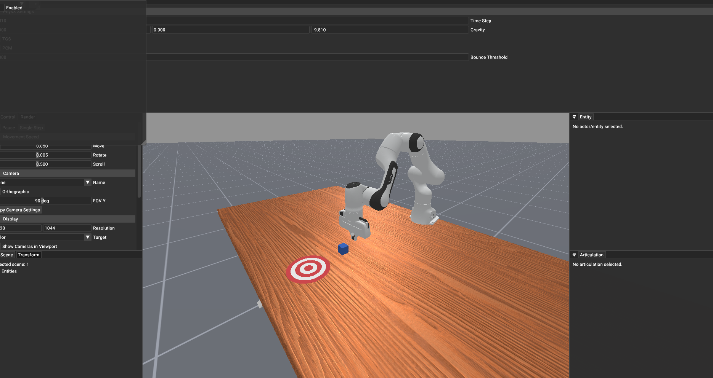

# TinyVLA

A single file implementation of a VLA from scratch, except we dont support text instructions as text
doesnt matter at this scale.

Supports FAST tokenizer, causal self attention, RoPe, etc...

## TODO
* Add action expert and flow matching training.
